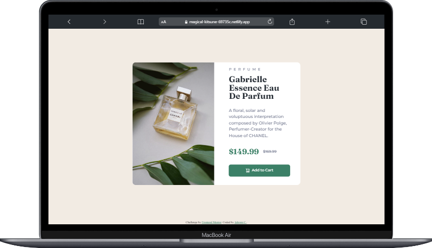
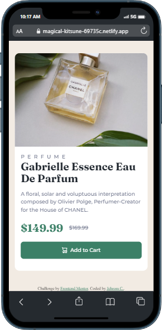

# Frontend Mentor - Product preview card component solution

This is a solution to the [Product preview card component challenge on Frontend Mentor](https://www.frontendmentor.io/challenges/product-preview-card-component-GO7UmttRfa). Frontend Mentor challenges help you improve your coding skills by building realistic projects.

## Table of contents

- [Overview](#overview)
  - [The challenge](#the-challenge)
  - [Screenshot](#screenshot)
  - [Links](#links)
- [My process](#my-process)
  - [Built with](#built-with)
  - [What I learned](#what-i-learned)
  - [Continued development](#continued-development)
  - [Useful resources](#useful-resources)
- [Author](#author)
- [Acknowledgments](#acknowledgments)

## Overview

This is my first solution for the FEM challenge.

### The challenge

Users should be able to:

- View the optimal layout depending on their device's screen size
- See hover and focus states for interactive elements

### Screenshot

  
Preview on Desktop. <br />
<br />
<br />
  
Preview on Mobile. <br />

### Links

- Solution URL: [https://github.com](https://github.com/jehromc/FrontendMentor-Challenges/tree/main/product-preview-card-component-main)
- Live Site URL: [https://magical-kitsune-69735c.netlify.app](https://magical-kitsune-69735c.netlify.app/product-preview-card-component-main/index.html)

## My process

### Built with

- Semantic HTML5 markup
- Sass
- Vite js
- Flexbox
- CSS Grid
- Mobile-first workflow
- [Vitejs](https://vitejs.dev/) - Frontend Tool

### What I learned

My learnings in this challenge

This is other options to shows image when screen is change:

```html
<picture>
  <source
    media="(min-width: 616px)"
    srcset="images\image-product-desktop.jpg"
  />
  
</picture>
```

This will include the nested folder in npm run build:

```js
import { resolve } from 'path';
import { defineConfig } from 'vite';

export default defineConfig({
  build: {
    rollupOptions: {
      input: {
        main: resolve(__dirname, 'index.html'),
        nested: resolve(
          __dirname,
          'product-preview-card-component-main/index.html'
        ),
      },
    },
  },
});
```

If you want more help with writing markdown, we'd recommend checking out [The Markdown Guide](https://www.markdownguide.org/) to learn more.

### Continued development

I wanted to learn more about vite js especially how it work in the hood. For now, I just barely scratch the surface.  
I wanted to explore on Semantics approach and the Accessibility of the website

### Useful resources

- [Solution by vcarames in FEM](https://www.frontendmentor.io/solutions/product-preview-card-component-za4kCCWY0P) - This help in structuring your code and using <picture> to change image.

## Author

- Frontend Mentor - [@jehromc](https://www.frontendmentor.io/profile/jehromc)

## Acknowledgments

This is where you can give a hat tip to anyone who helped you out on this project. Perhaps you worked in a team or got some inspiration from someone else's solution. This is the perfect place to give them some credit.

**Note: Delete this note and edit this section's content as necessary. If you completed this challenge by yourself, feel free to delete this section entirely.**
